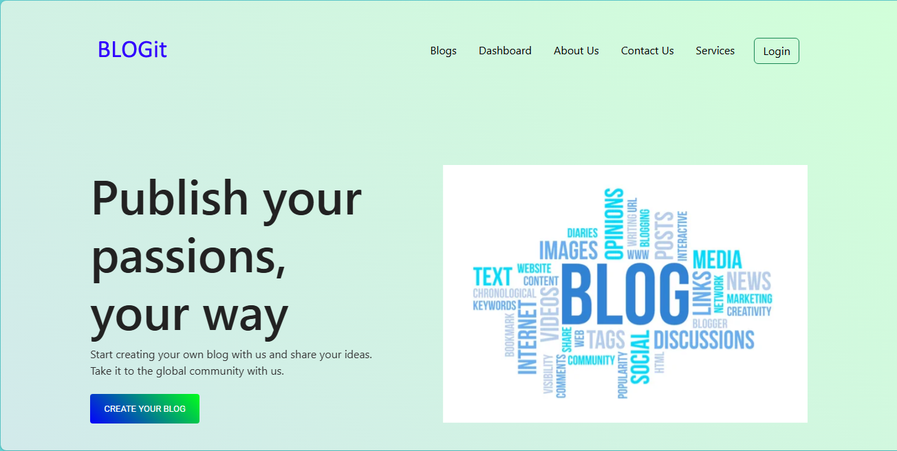

# Blog Website

# Description:
A web-based platform for creating and sharing blog posts. Users can publish articles and interact through comments.A simple blog application with features for creating and publishing posts.

# Technologies Used:
* Programming language: HTML, CSS, PHP, JavaScript
* Framework: Bootstrap
* Database: MySQL
* Version Control: Git, GitHub
 
# Usage:
Users can create, edit, and delete posts.
Users can comment on posts.
The blog displays posts in a user-friendly format.

# Contributing:
Feel free to fork the repository and submit pull requests.

# License

**Code License**
The source code for this project is licensed under the MIT License. See the [LICENSE](LICENSE) file for more details.

**Content License**
The text, images, and other content of this blog are licensed under a [Creative Commons Attribution 4.0 International License](https://creativecommons.org/licenses/by/4.0/).

**Attribution**
Please credit the author when using or adapting the content. For code, include a notice as specified in the MIT License. For content, include a link back to this site or the original content page.

**Acknowledgments**
- **Bootstrap**: The website design utilizes Bootstrap, which is licensed under the MIT License.

# Contact:
____________
